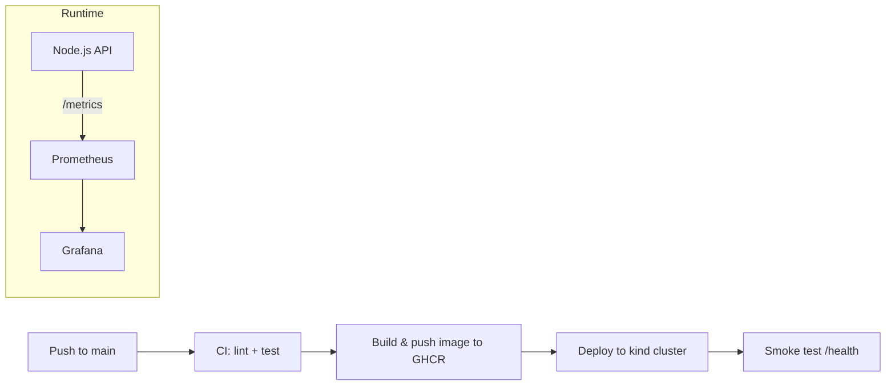

# DevOps End-to-End Pipeline

A small task-tracking API used as a vehicle to demonstrate a complete DevOps pipeline: application code, containerization, CI/CD, Kubernetes deployment, and monitoring.

## Architecture



## Components

| Layer | Tooling |
|---|---|
| Application | Node.js + Express task API (`app/`) |
| Tests | Jest + Supertest (`app/test/`) |
| Containerization | Multi-stage `Dockerfile`, non-root user, healthcheck |
| CI/CD | GitHub Actions (`.github/workflows/ci-cd.yml`): lint → test → build & push to GHCR → deploy to an ephemeral kind cluster → smoke test |
| Orchestration | Kubernetes manifests (`k8s/`): namespace, deployment (readiness/liveness probes, resource limits), service |
| Monitoring | Prometheus scraping `/metrics`, Grafana dashboard provisioned automatically (`monitoring/`) |

## Running locally

Full stack (app + Prometheus + Grafana) via Docker Compose:

```bash
docker compose up --build
```

- App: http://localhost:3000
- Prometheus: http://localhost:9090
- Grafana: http://localhost:3001 (admin/admin)

## App API

| Method | Path | Description |
|---|---|---|
| GET | `/health` | Liveness/readiness check |
| GET | `/metrics` | Prometheus metrics |
| GET | `/api/tasks` | List tasks |
| POST | `/api/tasks` | Create a task (`{ "title": "..." }`) |
| POST | `/api/tasks/:id/complete` | Mark a task complete |

## Running the app's tests

```bash
cd app
npm install
npm run lint
npm test
```

## Deploying to Kubernetes manually

```bash
kubectl apply -f k8s/namespace.yaml
kubectl create secret docker-registry ghcr-pull-secret \
  --docker-server=ghcr.io \
  --docker-username=<your-gh-username> \
  --docker-password=<a-ghcr-read-token> \
  -n devops-e2e
kubectl apply -f k8s/deployment.yaml
kubectl apply -f k8s/service.yaml
```

## CI/CD pipeline

On every push to `main`, GitHub Actions:

1. Installs dependencies and runs lint + tests.
2. Builds the Docker image and pushes it to `ghcr.io/<owner>/devops-e2e-pipeline`.
3. Spins up an ephemeral [kind](https://kind.sigs.k8s.io/) cluster, deploys the freshly built image using the manifests in `k8s/`, and waits for the rollout.
4. Smoke-tests the deployed app's `/health` endpoint through a port-forward.

Pull requests only run the lint/test stage.
