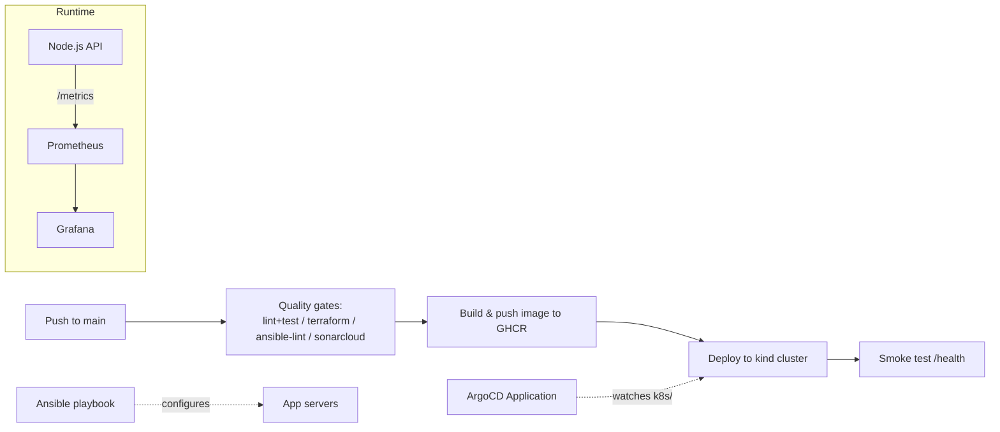

# DevOps End-to-End Pipeline

A small task-tracking API used as a vehicle to demonstrate a complete DevOps toolchain: Infrastructure as Code, containerization, CI/CD quality gates, GitOps, configuration management, and monitoring.

## Architecture



## Components

| Layer | Tooling |
|---|---|
| Application | Node.js + Express task API (`app/`) |
| Tests | Jest + Supertest, coverage via `test:coverage` (`app/test/`) |
| Containerization | Multi-stage `Dockerfile`, non-root user, healthcheck |
| Infrastructure as Code | Terraform (`terraform/`): modular VPC module, environment `tfvars` (dev/qa/uat), validated with `terraform fmt`/`validate`, linted with TFLint, exercised with `terraform test` against a mocked AWS provider (no cloud credentials needed) |
| CI/CD | GitHub Actions (`.github/workflows/ci-cd.yml`): lint/test + terraform + ansible-lint (+ optional SonarCloud) run as parallel quality gates → build & push to GHCR → deploy to an ephemeral kind cluster → smoke test |
| Code quality | SonarCloud scan (`sonar-project.properties`) — gated on a `SONAR_TOKEN` repo secret; skipped (not failed) until configured |
| Orchestration | Kubernetes manifests (`k8s/`): namespace, deployment (readiness/liveness probes, resource limits, image pull secret), service |
| GitOps | ArgoCD `Application` manifest (`argocd/application.yaml`) — points at this repo's `k8s/` path with automated sync/prune/self-heal |
| Configuration management | Ansible playbook (`ansible/`) to install Docker, log in to GHCR, and run the container on plain VMs — an alternative deployment path to Kubernetes |
| Monitoring | Prometheus scraping `/metrics`, Grafana dashboard provisioned automatically (`monitoring/`) |

## Running locally

Full stack (app + Prometheus + Grafana) via Docker Compose:

```bash
docker compose up --build
```

- App: http://localhost:3000
- Prometheus: http://localhost:9090
- Grafana: http://localhost:3001 (admin/admin)

## App API

| Method | Path | Description |
|---|---|---|
| GET | `/health` | Liveness/readiness check |
| GET | `/metrics` | Prometheus metrics |
| GET | `/api/tasks` | List tasks |
| POST | `/api/tasks` | Create a task (`{ "title": "..." }`) |
| POST | `/api/tasks/:id/complete` | Mark a task complete |

## Running the app's tests

```bash
cd app
npm install
npm run lint
npm test
npm run test:coverage   # generates app/coverage/lcov.info for SonarCloud
```

## Terraform

```bash
cd terraform
terraform init -backend=false
terraform fmt -check -recursive
terraform validate
tflint --init && tflint --recursive
terraform test              # runs against a mocked AWS provider, no credentials needed
terraform plan -var-file=environments/dev.tfvars   # requires real AWS credentials to actually plan/apply
```

## Ansible

```bash
cd ansible
ansible-galaxy collection install -r requirements.yml
ansible-lint playbook.yml
ansible-playbook -i inventory.example.ini playbook.yml \
  -e ghcr_username=<your-gh-username> -e ghcr_token=<a-ghcr-read-token>
```

## ArgoCD

Apply `argocd/application.yaml` to a cluster running ArgoCD to have it continuously sync `k8s/` from this repo:

```bash
kubectl apply -f argocd/application.yaml
```

## Deploying to Kubernetes manually

```bash
kubectl apply -f k8s/namespace.yaml
kubectl create secret docker-registry ghcr-pull-secret \
  --docker-server=ghcr.io \
  --docker-username=<your-gh-username> \
  --docker-password=<a-ghcr-read-token> \
  -n devops-e2e
kubectl apply -f k8s/deployment.yaml
kubectl apply -f k8s/service.yaml
```

## CI/CD pipeline

On every push to `main`, GitHub Actions:

1. Runs four quality gates in parallel: app lint/test, Terraform (`fmt`, `validate`, TFLint, `terraform test`), `ansible-lint`, and (if `SONAR_TOKEN` is configured) a SonarCloud scan.
2. Builds the Docker image and pushes it to `ghcr.io/<owner>/devops-e2e-pipeline`.
3. Spins up an ephemeral [kind](https://kind.sigs.k8s.io/) cluster, deploys the freshly built image using the manifests in `k8s/`, and waits for the rollout.
4. Smoke-tests the deployed app's `/health` endpoint through a port-forward.

Pull requests only run the quality-gate stage.

### Enabling the SonarCloud gate

The `sonarcloud` job is skipped (not failed) until you:

1. Create a free account at [sonarcloud.io](https://sonarcloud.io) and import this GitHub repo.
2. Generate a token and add it as a repo secret named `SONAR_TOKEN` (Settings → Secrets and variables → Actions).
3. Update `sonar.projectKey` / `sonar.organization` in `sonar-project.properties` to match what SonarCloud assigns.
